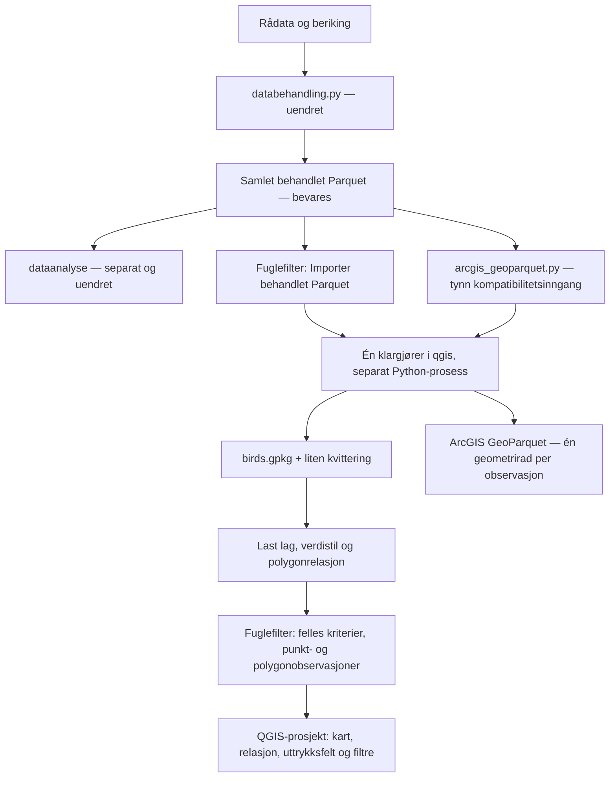

# Behandlet Parquet → QGIS og ArcGIS

## Status og avgrensning

**2026-09-22 — teknisk implementering og kontroller bestått; Word-kontroll gjenstår.**
Se [rettingsplanen og sluttresultatet nederst](#rettingsplan-etter-publiseringsrevisjon-2026-09-22).
F1–F13 er implementert og automatisk kontrollert etter brukerens godkjenning.
Dette er ikke publiseringsgodkjenning. Avsnittene fram til rettingsplanen er
**historikk**, ikke gjeldende driftsinstruks; tidligere analyseavgrensning og
wrapper-inngang er erstattet av de uttrykkelige beslutningene nedenfor.

**Beslutningene er godkjent:** Brukeren svarte «follow all your recommendations»
også på siste runde om import, polygonfarger, presist radutvalg og ArcGIS-format.
Planen er implementert i arbeidskopiene til dette repositoriet og `~/qgis`.
Endringene er ikke committet eller pushet.

- `databehandling/databehandling.py` kjøres som før og skal ikke endres.
- `dataanalyse/` er en separat analyseflyt og skal ikke endres av dette arbeidet.
- Utgangspunktet er den samlede, ferdigbehandlede Parquet-filen. Den er fasit
  for observasjoner og attributter; GIS-importen endrer den ikke.
- Ingen Marimo-integrasjon, analysearkivering, gjenkjøring av analyser eller
  ny plugin/rammeverk bygges. QGIS-prosjektet lagrer visningstilstanden.
- ArcGIS får selvstendige datafiler, ikke et automatisert prosjekt/grensesnitt.

Begreper og identitet er beskrevet i [`../CONTEXT.md`](../CONTEXT.md).
Den operative dokumentasjonen og det detaljerte kodekartet eies av GIS-repoet:
`~/qgis/qgis-naturmangfold/qt6/environment/references/bird-data-workflow.md`.
Dette dokumentet beskriver beslutningene og grensen mellom repositoriene.

## Samlet dataflyt



Klargjørerens funksjoner brukes også av kompatibilitetsinngangen; denne lager
bare ArcGIS-filer, ikke QGIS-leveransen. Ingen gruppering dupliseres i fuglerepoet.

## Godkjente valg

| Tema | Beslutning |
|---|---|
| Én inngang | Importhandlingen i eksisterende Fuglefilter styrer normalflyten. |
| Eksisterende prosjekt | Importer i det åpne, lagrede kartprosjektet; behold andre lag. |
| Eksisterende punktfilter | Behold operatører, kart ↔ tabell-utvalg, utvalg ∩ filter, demping, midlertidig visning og reset. |
| Aktivt datasett | Ett om gangen. Ingen automatisk sammenslåing av flere leveranser. |
| Polygonmodell | Ett kartfotavtrykk og en separat rad per tilknyttet observasjon. |
| Klikkbetydning | Registrert kobling gjennom polygon-ID, ikke geografisk punkt-i-polygon. |
| Delte kriterier | Art, år og øvrige eksisterende kolonnefiltre gjelder begge observasjonstypene. |
| Polygonfarge og telling | Følg filtrerte barn; høyeste eksisterende verdi vinner. Null treff skjuler polygonet. |
| Presist barnutvalg | Én valgt barnerekke markerer fotavtrykket, men velger ikke søsken. |
| Polygonutvalg | Velg bare tilknyttede barn som passer gjeldende filter; flere polygoner gir unionen. |
| ArcGIS | Lange punkt-/polygonfiler med fullstendige attributter; gjentatt polygongeometri er bevisst. |
| Lagring | QGZ og prosjektlokale avledede data; relative referanser med QGIS-standardoppsett. |
| Overskriving | Ingen automatisk overskriving; klargjør og kontroller ny leveranse før publisering. |
| Midlertidige radvalg | Ingen egen persistensmekanisme/utvalgsarkivering. |

## Datakontrakt

### Kilde og identitet

`obs_id` er observasjonsidentiteten fra `proxyId`: unik, ikke-tom tekst.
`Artens ID` identifiserer et taksonomisk navn, ikke en observasjon og ikke
nødvendigvis et artsnivå. `Antall` er ikke en opptelling av observasjonsrader.
Ingen ny artsantallsdefinisjon eller faglig verdiklassifisering innføres.

Klargjøringen krever gyldig todimensjonal WKT Point/Polygon, de etablerte filterfeltene og
eksplisitt kilde-CRS. Manglende identitet, ugyldig/tom geometri, multipart,
reserverte GIS-felter, Z/M-koordinater og tomt datasett avvises. Alle ekstra attributter bevares.
CRS tilordnes etter bekreftelse; importen reprojiserer ikke koordinatene.

### QGIS-leveranse

| Lag/tabell | Innhold |
|---|---|
| `bird_points` | Alle punktobservasjoner og kildeattributter med kartgeometri. |
| `bird_polygons` | Unike fotavtrykk med stabil `polygon_id`, totalantall og høyeste registrerte verdi. |
| `bird_polygon_observations` | Alle polygonobservasjoner og kildeattributter med `obs_id` og `polygon_id`, uten gjentatt kartgeometri. |

Polygon-ID bygges fra eksakt normalisert WKB (SHA-256), uten toleranse eller
sammenligning av bare avgrensningsbokser. Omordnet input gir samme identitet.
Ulike former forblir ulike, også om de overlapper eller har samme utstrekning.

Ved lasting opprettes en ekte QGIS-relasjon, barneskjema og **Vis observasjoner**.
Filtrerte tellinger og verdier er native QGIS-uttrykksfelter som følger
barnelagets filter. De lagres med prosjektet, ikke tilbake i observasjonene.
Derfor kan også en lagret, flyttet prosjektmappe gjenåpnes med riktig visning.
Lagene åpnes uten redigeringstilgang; filteret redigerer ikke GeoPackage-innholdet.

**Referanseeksempel:** 1000 registreringer deler ett polygon. 20 uavhengige
punkter ligger geografisk innenfor. Polygonvalg gir 1000 barn, ikke 1020.
Matcher bare 40 barn et arts-/årsfilter, gir polygonvalget 40 rader. Et valg
av én av disse radene skal ikke ekspandere til alle 40 eller 1000.

### ArcGIS-leveranse

`<navn>_punkter.parquet` og `<navn>_polygoner.parquet` bruker GeoParquet 1.0.0,
WKB og eksplisitt CRS. Bare typer som finnes, eksporteres. Hver rad beholder
sin geometri og sine opprinnelige attributter. Det forutsettes ikke at en
QGIS-relasjon overføres til ArcGIS. Polygonene kan derfor ligge oppå hverandre
her; ingen lovnad om unike kartpolygoner i ArcGIS er del av dette valget.

## Kilde, installasjon og data

```text
~/qgis/                                          kanonisk GIS-kilde
├── qgis-geoai/plugins/observation_filter/
│   ├── plugin.py                                eksisterende kontroller + import
│   └── dataset.py                               felles filter og polygonutvalg
└── qgis-naturmangfold/qt6/environment/
    ├── scripts/bird_schema.py                    delte felt og verdier
    ├── scripts/prepare_bird_data.py              én klargjøring/eksport
    ├── scripts/bird_data.py                      lag, stil, relasjon
    └── references/bird-data-workflow.md          driftsdokumentasjon

~/dotfiles/                                      launchere/registrering, ikke GIS-kopi
<qgis-profil>/python/plugins/observation_filter    lenke til kanonisk kilde

<kartmappe>/
├── prosjekt.qgz
└── prosjekt_data/birds/<datasett>/
    ├── birds.gpkg
    ├── birds.json                               kildehash, CRS og radkontroller
    └── arcgis/*_{punkter,polygoner}.parquet
```

`birds.json` er en liten leveransekvittering, ikke et analysearkiv.
Prosjektdata skal ikke ligge i kildekode- eller pluginmappen. Installerte
lenkemål og miljøoppsett er ikke endret; det trengs ingen ny skill eller pakke.

Klargjøreren kjører gjennom `uv` uten QGIS-miljøets bibliotekstier. QGIS-delen
importerer ikke prosjektbyggerens CLI, som kan påvirke Qt-miljøet. En komplett
ny leveranse publiseres ved mappeomdøping etter validering. Eksisterende
utdatamapper avvises, også dersom en tidligere kartleveranse fortsatt er åpen.

## Hva som ble gjenbrukt, og hva som ble erstattet

- Eksisterende Fuglefilter og dets punktregresjonstest beholdes.
- Eksisterende GIS-klargjøring, verdipalette, lagorganisering og relasjon brukes
  videre; inngangen er nå samlet behandlet Parquet, ikke to eldre eksportfiler.
- `databehandling/arcgis_geoparquet.py` delegerer til GIS-koden. Den tidligere
  lokale grupperingen og de rekkefølgeavhengige polygon-ID-ene er fjernet.
- Ingen artslister aggregeres i stedet for observasjoner, og ingen uvalidert
  `Navn.nunique()`-beregning kan gi et sent avbrudd etter delvis eksport.
- Dynamisk full-SELECT i OGR-subset ble prøvd, men ga providerfeil i testen.
  Standard WHERE-filter og QGIS-uttrykksfelt erstatter dette uten å skrive data.
- Den separate analyse-/utvalgs-/replay-koden i arbeidskopien er ikke del av
  denne leveransen og skal ikke ryddes bort eller blandes inn.

## Kontroller og gjenværende validering

Kontrollkommandoene er samlet i GIS-arbeidsflyten ovenfor.
**Resultat i denne arbeidskopien:** 12 ArcGIS-tester, 3 datatester og 2 QGIS-tester
bestått, i tillegg til kontroll av verdistil/tegnerekkefølge. Alle 17 installerte
GIS-lenker er riktige; de fire beskyttede Python-filene har uendrede SHA-256-hasher.

- Datakontroller: alle observasjoner/attributter, stabil normalisering,
  punkt-only/polygon-only, ugyldig input, ingen overskriving og skrivefeil.
- Eksisterende punkttest: samme operatører, filter/utvalg, status, demping,
  midlertidig visning, ekstern grunnfiltrering og opprydding.
- QGIS-integrasjon: reell menyimport og separat prosess, 1000 koblede barn,
  presist barnutvalg, flervalg, delte kriterier, geometri og null treff,
  filtrerte farger/tellinger, rollback ved feil, gjenåpning og flytting.
- QGIS-relasjon og filteruttrykk gjenåpnes fra QGZ. Hele SQL-innholdet
  sammenlignes før/etter for å oppdage utilsiktet dataskriving.
- ArcGIS-inngangens tester: radbevaring og GeoParquet-geometri, ugyldig input,
  stabile CLI-returkoder og vern av eksisterende filer.
- Eksisterende test av verdifarger/tegnerekkefølge og `gis-setup check` er bestått.
- Beskyttede databehandlings-/analysefiler er kontrollert mot hasher fra starten.

**Ikke verifisert i denne økten:** åpning i faktisk ArcGIS, storproduksjonsdata
med mange komplekse fotavtrykk, og en interaktiv gjennomgang i brukerens
ordinære QGIS-vindu. Midlertidige offscreen-prosjekter brukes i testene;
brukerens eksisterende kartprosjekter endres ikke.

## Rettingsplan etter publiseringsrevisjon, 2026-09-22

**Status: teknisk implementering og automatiserte akseptansekontroller bestått.**
Etter Q12 svarte brukeren også «yes» på den uttrykkelige forespørselen om
å bekrefte hele planen og autorisere implementering. Resultat, funnvis bevis,
gjenkjøring og oppgavediff finnes i
`/home/havhje/prosjekter_mc_offentlige_data/laagen/fuglefilter_validation/remediation_20260922_180948/`:
`REPORT.md`, `REPRODUCE.md`, `integrity-final.json` og `task.diff`.
Planen nedenfor er akseptansegrunnlag; disse kontrollartefaktene dokumenterer utfallet.

### Sluttresultat, 2026-09-22

- Fase 1–4 er gjennomført. **130 tester** i hovedsuitene er bestått:
  analyse 104 (inklusive 12 notebooktester), konvertering 8, worker 6,
  native filter/datasett 5 og native statistikk/WebEngine 7. I tillegg er
  ti kartgjengivelsesscenarier og en faktisk leveransebevaringsprobe bestått.
- Alle **174 001** observasjoner, attributter/geometrier, **77** fotavtrykk
  og **14** MultiPolygon-observasjoner er uavhengig avstemt. Separate
  rapporter har **268/163** kildepar og summer **1 831 932/64 802**.
  Gruppene og tidsaggregatene er kontrollert mot selvstendige forventninger.
- Nye faktiske leveranser har **171** reelle PNG-sider og **7** syntetiske.
  **6 034** reelle tekstceller, datodekning og farger er kontrollert.
  Minste synlige tekst er **9,7486 pt ved 26,7 cm**, også fotnotemerker.
  For små superskrifter/etterkommere/SVG avvises; rullefelt i trykkoverskrifter
  og linjebrudd av et fotnotemerke ble fanget visuelt, rettet og regresjonstestet.
- Alle tre engangsmutantene ble fanget: `N→N+1`, `[]→None` og parnøkkel→ID.
  Produksjonskode ble ikke mutert. Den avviklede wrapperens testgarantier er
  flyttet til den kanoniske konvertereren.
- Original Parquet, rådatabehandling og attributtdatabase har uendrede hasher.
  **51** fryste kildekopier og **592** revisjonsartefakter matcher eksisterende
  manifest. Brukerprosjekter er ikke åpnet/lagret. Begge Git HEAD-er er uendret;
  eldre arbeidskopiendringer er beholdt og ingen staging/commit/push er gjort.
- **Manuelt stoppunkt:** faktisk Word-innsetting, komprimering, størrelse,
  lesbarhet og siderekkefølge gjenstår. F11s Word-port er ikke lukket av PNG-
  kontrollen. ArcGIS-åpning, interaktiv Marimo-UI og Qt5 er heller ikke
  verifisert. Ingen installasjon eller publiseringsgodkjenning er utført.

### Grunnlag og eierskap

Revisjonsrapport, reproduksjoner og kildeøyeblikksbilde beholdes uendret i:
`/home/havhje/prosjekter_mc_offentlige_data/laagen/fuglefilter_validation/publication_audit_20260922/`.
`REPORT.md` beskriver funnene F1–F13; `REPRODUCE.md` beskriver kjøringene.
Kontrollen ved planleggingsstart fant alle 51 fryste filer uendret og samme
Git-status som ved revisjonens slutt. GIS HEAD er
`fb6019757187bc36040336a0768c5b6493f0c06b`; analyse HEAD er
`d53ac6d9a49404db16da240a7ecb2964f91941a0`. Begge arbeidskopier har egne
endringer som skal bevares. Commit-ID alene beskriver ikke arbeidskopiene.

Denne filen eier planen og beslutningene på tvers av repositoriene.
`CONTEXT.md` er kun ordliste. Den kanoniske GIS-arbeidsflyten og pluginens
README oppdateres som del av gjennomføringen, uten å påstå at planlagte
rettinger allerede finnes. Planen og beslutningsloggen skrives på norsk.

### Beslutningslogg — runde 1, godkjent

Brukeren valgte Q4=A og Q6=B, og bekreftet deretter anbefalingene i Q1, Q2,
Q3 og Q5 samlet med «yes to all».

| Spørsmål | Godkjent beslutning | Betydning for gjennomføringen |
|---|---|---|
| Q1 — omfang | Rett plugin, GIS-konverteringsavhengigheter og delte analyse-/presentasjonsfunksjoner i begge repositorier. Rådatainnlesing og beriking holdes uendret i denne fasen. | Det tidligere forbudet mot endringer i `dataanalyse/` oppheves uttrykkelig for disse rettingene. `databehandling/databehandling.py`, originale data og eksisterende prosjekter skal ikke endres. Eksisterende imputeringsregler beskrives, ikke endres bak brukerens rygg. |
| Q2 — polygonenes grunnfilter | Et eksplisitt eksternt subset på polygonlaget avgrenser også tilknyttede polygonobservasjoner og rapporten. | Kombiner forelderens grunnfilter, barnas filtre og eventuelt utvalg. Punktfanen påvirkes ikke av forelderens subset. Vanlig kartutsnitt eller visningsavkryssing blir ikke automatisk observasjonsfilter. |
| Q3 — utskiftet datakilde | Steng utdatert panel/rapport og krev ny åpning når lagets datakilde skiftes. | Eksport skal sperres straks; gammelt arbeid kan ikke bli gjeldende igjen. Kilde, skjema og relasjoner valideres ved ny åpning. Gamle feature-ID-utvalg overføres ikke automatisk til ny kilde. Automatisk full gjenoppbygging bygges ikke i denne fasen. |
| Q4 — etterprøvbarhet | Manuell bevaring av analysegrunnlag; ingen automatisk sidefil eller nytt analysearkiv. | Dokumenter hva forfatteren må beholde: kildeidentitet, aktiv observasjonstabell, nøyaktige filtre og utvalgsidentitet, beregningsdefinisjoner og programtilstand. Ikke legg til eksportartefakter som brukeren har valgt bort. |
| Q5 — lesbarhet | Minst 9 pt gjelder all synlig PNG-tekst, også hevede fotnotemerker, ved dokumentert innsettingsstørrelse. | Flere sider er akseptabelt. Ingen krymping eller klipping for å nå et sidetall. Faktisk Word-innsetting er en separat kontroll; piksler/DPI alene er ikke bevis. |
| Q6 — separat ArcGIS-inngang | Avvikle `databehandling/arcgis_geoparquet.py` formelt; ikke gjenopprett den. | Oppdater dokumentasjon og tester for den avviklede inngangen. Behold pluginens ArcGIS-eksporter og den kanoniske konvertererens relevante integritetstester. Avvikling av wrapper er ikke avvikling av ArcGIS-leveransen. |

Følgende allerede dokumenterte krav gjelder fortsatt og er ikke åpne valg:
aktiv observasjonsfane uten automatisk punkt-/polygonsum; eksisterende utvalg
med null filtertreff gir tomt resultat; taksa omtales ikke ukritisk som arter;
observasjoner telles uavhengig av fotavtrykk og multipart-deler; kildeattributter
og geometrier skal ikke redigeres av filtre; delvise leveranser publiseres ikke;
QGIS- og analysemiljøene holdes adskilt. Dagens MultiPolygon-støtte beholdes;
den historiske setningen om multipart-avvisning ovenfor skal ikke brukes som
krav for rettingsarbeidet.

### Beslutningslogg — runde 2, oppdatert etter API-kontroll og prototype

Brukeren ba om kontroll av NorTaxa og faktisk `databehandling.py`-logikk,
visuell HTML-prototype for Q10 og viste til sitt tidligere svar på Q11.
«Otherwise approved» er registrert som godkjenning av Q8 og Q9; det er
ikke godkjenning til å starte produksjonsrettingene.

- **Q8 — godkjent: strenge individtall.** Godta ikke-negative heltall,
  inkludert tallet 0. Stopp rapporten på negative, manglende, flyttalls-,
  boolske eller numeriske tekstverdier; ingen stilltiende imputering,
  trunkering eller radfjerning. Valider før cast i både worker og adapter.
  Håndter smale/brede heltall uten overflyt, og avvis verdier eller summer
  utenfor eksakt ikke-negativ Int64-støtte (`0` til `2**63−1`). Gjennomsnitt
  er sum delt på antall inkluderte observasjonsrader. Oppstrøms imputering
  i `databehandling.py` endres ikke.
- **Q9 — godkjent: kalenderdato, ikke tidsstempel.** Støtt Date i ferdige
  inputdata, konsistent i konvertering og analyse. Avvis tidsstempler, også
  ved midnatt, i stedet for å velge UTC, tidssone eller trunkering uten avtale.
  Dokumenter innsnevret kompatibilitet og test begge innganger. Manglende
  dato er en separat Q10-regel; tidssonegrenen utgår i denne fasen.
- **Q11 — følg de behandlede kildefeltene.** `validScientificNameId` blir
  `Artens ID`, `validScientificName` blir `Art`, `preferredPopularName`
  blir `Navn` og `scientificNameRank` blir `Taksonomisk nivå`. Bevar disse
  betydningene og kildeverdiene; ikke erstatt dem med foreldreart, API-takson-ID,
  et nytt navn fra dagens API eller en ny taksonomisk tolkning. Norsk navn
  er presentasjonsmetadata, ikke grupperingsnøkkel. Pluginen skal ikke gjenta
  NorTaxa-/ANF-oppslag eller den manuelle norske navnerunden.
- **Q11 — ID alene er fortsatt avvist.** Ulike vitenskapelige navn skal
  kunne forbli separate rapportgrupper selv med samme `Artens ID`.
  Utgangspunktet er samme kildepar `(Artens ID, Art)` i relevante tellinger;
  arts-/underartsoppføringer skal ikke automatisk slås sammen. Preprocessing
  bevarer også gamle/synonyme eller motstridende navnepar: flere rapportgrupper
  er derfor ikke bevis for like mange biologisk ulike taksa eller arter.
  Manglende nøkler er avklart i Q12; visningsordlyd er valgt i Q13.
  Ingen automatisk tekst-/synonymnormalisering innføres som en antatt
  egenskap ved `databehandling.py`; den gjør ikke dette.
- **Q10 — valgt: forenklet B.** Brukeren valgte stripe og prosent ved hver
  månedsprofil, uten antall daterte/udaterte eller ekstra forklaring i raden.
  Helt udaterte grupper viser bare **«Ingen daterte observasjoner»**;
  teksten «2 udaterte · teller fortsatt i totalene» og tilsvarende fjernes.
  Ingen trettende måned eller tolv misvisende nullsøyler. Udaterte
  observasjoner beholdes i antall, individtall og gjennomsnitt, men ikke i
  tidsstatistikk. Dette er videreført fra prototypens faglige regel, ikke
  filtrering eller endring av kildedata.
- **Q13 — valgt visningsspråk: «Arter (inkl. underarter)».** Brukeren avviste
  «taksonoppføringer» som for omstendelig og foreslo «arter» eller den
  kvalifiserte varianten; sistnevnte brukes. Brukerens «q3» viser til tredje
  spørsmål i forrige svar (Q13), ikke tidligere Q3 om datakildeskifte.
  Gruppering/telling endres ikke av navnevalget. Kort faglig presisering i
  prototypen: «Tellingen følger kildens ID og navn; også høyere taksonomiske
  nivåer og navnevarianter kan inngå.» Dette er ikke et løfte om et rent mål
  på artsrikdom, og høyere nivåer fjernes ikke stilltiende. Visningsvalget
  erstatter forslaget om «taksa»/«taksonoppføringer» som hovedetikett.
- **Q12 — godkjent: stopp rapport ved ufullstendig nøkkel.** Brukeren svarte
  «yes» til at manglende ID eller vitenskapelig navn skal gi en tydelig feil,
  ikke gjetting eller stilltiende utelatelse av observasjoner. Null, tomt
  eller bare whitespace i vitenskapelig navn regnes som manglende. Dette
  er en ny rapportregel; `databehandling.py` endres ikke. Ikke-blanke navn
  beholdes eksakt, uten trimming som endrer grupperingsnøkkelen. Hele det
  inkluderte observasjonsgrunnlaget valideres før tidsaggregering; en
  manglende dato skal ikke skjule en ugyldig taksonnøkkel.

Faktakontroll av lokal Lågen-fil: 274 ulike ID-er og 274 ulike
`(Artens ID, Art)`-par; ingen ID hadde flere vitenskapelige navn.
Limosa-radene er slekten `Limosa` (2), `Limosa lapponica` (19) og
`Limosa limosa` (34), uten det nevnte underartseksemplet. Dette begrenser
hva filen kan bevise, ikke brukerens krav. En syntetisk regresjon med samme
ID og ulike vitenskapelige navn skal fortsatt inngå.

Førstepartsfakta, eksakte API-lenker, lokal dataflyt og reproduksjoner er
samlet i [NorTaxa-identitetsnotatet](nortaxa-identitet-research.md).
Live Limosa-art/underarter har egne vitenskapelige navne-ID-er
**3767/3768/3769** og takson-ID-er **3708/3709/3710**. Bare det separate
foreldreartshjelpefeltet **`ArtNavnId=3767`** deles. Hjelpefeltet brukes
oppstrøms til fuglegruppe og eksporteres ikke som `Artens ID`.
NorTaxa har et eget takson-ID-domene og kan vise flere navn for samme takson;
preprocessing retter ikke automatisk kilde-ID/navn/rang etter API-responsen.
Den tillater også manglende taksonnøkler i enkelte rader. Rapportavvisning av
slike nøkler er nå godkjent i Q12 som en ny rapportregel, ikke gjenbruk av
inputkontrakten. Forskningsnotatets opprinnelige åpne spørsmål er historikk;
beslutningsloggen her er gjeldende.

### Q10 — lokal, kastbar HTML-prototype

Plassering ved rapportkoden:
`/home/havhje/qgis/qgis-geoai/plugins/observation_filter/prototype_date_coverage/`.
`index.html` åpnes direkte uten server eller nettverk; `build.py` bruker
analysemiljøet og dagens tabellhjelpere. Ingen pluginfil importerer prototypen.

- **A:** samlet dekningsstripe over rapporten, kompakte radmerknader.
- **B (valgt og forenklet):** bare dekningsstripe og prosent ved hver månedsprofil;
  helt udaterte rader sier bare «Ingen daterte observasjoner». Dette er standardvisningen.
- **C:** egen datodekningstabell før den vanlige artsstatistikken.
- Nedtrekket viser original datodekning, delvis simulert datomangel eller
  alle datoer skjult. Visning og relevant tilstand er synlig og ligger i URL-en.

Demoutvalget har **10 371 reelle punktobservasjoner**, **8 kildegrupper** og
**370 011 summerte, behandlede individtall**. Originalkilden har ingen
manglende datoer. I blandet scenario skjules **1 673 datoer kun i minnet**;
**8 698** er datert. Det er ikke en påvist datamangel i den virkelige filen.
Koordinater og observasjons-ID-er er ikke innebygd. Kildehash før/etter er lik.

Ni kombinasjoner er kontrollert i headless Chromium: rader, datotellere,
tomtilstand, synlig HTML-tekst ≥12 CSS-piksler, ingen JavaScript-feil eller
nettverkskall og fungerende variantbytte. Individ-/observasjonstall og månedstall
ble dessuten sammenlignet mot separat opptelling fra kilderegistreringene.
Dette er prototypekontroll, ikke publiseringsregresjoner, Word-test eller
PNG-godkjenning. Etter brukerens tilbakemelding kontrolleres også at B har
bare prosenttekst ved stripen, at tomtilstanden har nøyaktig ønsket tekst,
og at «Arter (inkl. underarter)» brukes som visningsnavn. Prototypen åpnes
med `xdg-open`; ingen commit/push, arkivgren, avhengighetsinstallasjon eller
produksjonsretting er gjort.

### Beslutningstre — faglige grener lukket

- Q1 → tillatt omfang; rådatabehandling, originaldata og prosjektfiler vernes.
- Q8/Q9 → strenge individtall, eksakt Int64-grense og Date-only; ingen
  stilltiende reparasjon eller separat tidssonepolicy i denne fasen.
- Q11/Q12/Q13 → bevar eksportens kildepar; stopp ved manglende nøkler;
  vis «Arter (inkl. underarter)» med kort presisering av tellegrunnlaget.
- Q10-B → stripe og prosent, eller bare «Ingen daterte observasjoner»;
  udaterte observasjoner beholdes i ikke-temporale totaler.
- Q2/Q3 → felles observasjonsavgrensning og avvikling av utdatert kildeavhengig
  tilstand; ingen automatisk sammenslåing eller gjenoppbygging.
- Q4/Q5/Q6 → manuell etterprøvbarhet, faktisk tekststørrelse og dokumentert
  wrapper-avvikling uten tap av ArcGIS-konvertering.
- **Samlet sluttbekreftelse er gitt.** Nye faktiske avvik som endrer
  kontrakten, skal likevel tas tilbake til brukeren, ikke avgjøres stilltiende.

### Funnregister — alle funn skal få en avklaring

Alle funn omfattes av tiltakene og kontrollene nedenfor. Ingen funn er
lukket som rettet før tilhørende akseptansekrav er dokumentert bestått.

| Funn | Retting eller avklaring som planen skal dekke | Nåværende beslutningsstatus |
|---|---|---|
| F1 | Behold forskjellen mellom intet utvalg og valgt-men-tomt, fra polygonkart via barnetabell til rapport/eksport. | Fast krav; tiltak og selvstendig fasit i fase 2 og regresjonsmatrisen. |
| F2 | Sperr og avvikle utdatert kildeavhengig tilstand ved datakildeskifte. | Q3 godkjent. |
| F3 | Bruk valgt etikett «Arter (inkl. underarter)», med presisering av tellegrunnlaget og av summerte, behandlede individtall. | Q11–Q13 avklart: bevar ulike kildepar, avvis manglende nøkler, ikke påstå ren artsrikdom. |
| F4 | Bevar og propagér eksplisitte polygon-grunnfiltre uten å forveksle dem med genererte filteruttrykk. | Q2 godkjent. |
| F5 | Valider antall og identifikatorer før tapsbringende typekonvertering. | Q8/Q12 godkjent; behold allerede eksplisitt heltallskrav for ID, uten ny positiv-ID-regel. |
| F6 | Kalenderdager må ikke telles som ulike klokkeslett. | Q9 godkjent: Date-only; test både korrekte datotellinger og avviste tidsstempler. |
| F7 | Samme observasjonskalender skal gjelde gjennom hele kjeden; ingen uuttalt UTC-konvertering. | Q9 godkjent: avvis tidsstempler fremfor å velge en tidssone. Dokumenter kompatibilitetsinnsnevringen. |
| F8 | Skill uklassifisert M1941 visuelt fra vurdert «Uten betydning for KU». | Kanonisk faglig skille gjelder; samsvar mellom visninger skal testes. |
| F9 | Kildetekst skal ikke bli HTML-kode i den delte tabellformatereren; unngå dobbel escaping i pluginen. | Sikkerhetskravet gjelder; delte kall og tester skal gjennomgås. |
| F10 | Manglende datakilde skal gi kontrollert feil også ved åpning av datofilteret. | Feil skal ikke skjules eller erstattes med oppdiktede datogrenser. |
| F11 | Kontroller synlig tekst, ikke bare cellestørrelse, piksler og DPI. | Q5 godkjent. |
| F12 | Unngå overflyt både innen grupper og i publiserte totalsummer. | Q8 godkjent: eksakt ikke-negativ Int64-støtte; stopp før overflyt, også for smale heltallstyper. |
| F13 | Fjern motstridende dokumentasjon/testavhengighet til avviklet wrapper, behold konverteringsgarantier. | Q6 godkjent. |

### Gjennomføring — rekkefølge og endringssteder

Forkortelser nedenfor:

- **A:** `/home/havhje/koding/fugl_artsdataanalyser/`.
- **P:** `/home/havhje/qgis/qgis-geoai/plugins/observation_filter/`.
- **G:** `/home/havhje/qgis/qgis-naturmangfold/qt6/environment/scripts/`.

Før oppstart registreres aktuell Git-status og kildehasher. Eldre
arbeidskopiendringer skal ikke nullstilles eller inkluderes ukritisk i en
senere commit. Revisjonsmappen er skrivebeskyttet arbeidsgrunnlag i denne
prosessen. Nye kjøringer får en ny, eksplisitt mappe under
`laagen/fuglefilter_validation/`, aldri over revisjonens bevis eller brukerens
prosjekter. Ugyldige data, mutasjoner, kildeflytting og skrivefeil prøves bare
med syntetiske data eller engangskopier.

#### Fase 1 — testgrunnlag og felles beregningskontrakt (F5–F7, F12–F13)

1. **Gjør relevante tester samlebare uten den avviklede wrapperen.** Overfør
   manglende konverteringsgarantier fra
   `A/databehandling/tests/test_arcgis_geoparquet.py` til eksisterende
   `G/test_prepare_bird_data.py`, før wrapperavhengige tester avvikles.
   Ikke bare pek gammel `SCRIPT/main/CRS` mot ny fil: grensesnittet er ulikt.
   Test den kanoniske `--input/--output/--crs`-CLI-en og behold eksisterende
   `arcgis_main`-dekning. Ingen wrapper gjenopprettes, og ingen duplisert
   konverteringsmotor eller ny avhengighet innføres.
2. **Etabler selvstendige forventninger før retting.** Utvid eksisterende
   tester i `A/tests_KI/test_qgis_analyse.py`, notebookens innebygde tester og
   `P/test_statistics_worker.py`. Samme-hjelper-paritet kan beholdes som
   integrasjonskontroll, men er ikke tallfasit. Alle tre aggregatorene prøves
   direkte; adapter og worker prøves ved sine eksisterende analyseinnganger
   og med faktisk lesing. Dette bestiller ikke nye månedstabeller i pluginen.
3. **Samle felles validering i det eksisterende beregningsmodulet**
   `A/dataanalyse/data_analyse.py`. Gjenbruk den fra artsstatistikk,
   månedsgrunnlag og dekningsmatrise; behold særskilte kolonnesett og
   eksisterende metadataregler. Ingen ny rammeverksklasse eller alternativ
   beregningsimplementasjon. Tidsfunksjonene må også kreve `Art` og telle
   distinkte `(Artens ID, Art)`, ikke bare ID. Marimo-cellenes avhengigheter
   og alle eksisterende kallere skal følge med endringen.
4. **Valider før cast og før tidsaggregering.** Rett
   `P/statistics_worker.py:observations` og
   `A/dataanalyse/qgis_utvalg.py:til_analysegrunnlag/filtrer_observasjoner`.
   Ikke la `2.9`, `True` eller `"2"` bli gyldige individtall gjennom cast.
   ID har allerede et heltallskrav; bevar dette uten å innføre en ny
   positiv-ID-regel. Identifikatorer skal heller ikke trunkeres, overflyte
   eller endres ved transport. Q8/Q12 gjelder hele det inkluderte grunnlaget
   etter eksplisitte filtre og utvalg, ikke uvedkommende rader utenfor dette.
   Datoens datatype kontrolleres før datofilteret prøver å bruke den. Som
   tidligere ligger en null-dato utenfor et aktivt datointervall; Q10 endrer
   ikke filteret, bare behandlingen av udaterte rader som faktisk er inkludert.
   Norsk navn kan fortsatt falle tilbake til det gyldige vitenskapelige
   navnet; det er ikke en ny identitet. Motstridende metadata innen samme
   kildepar gir fortsatt feil, ikke et tilfeldig førstevalg.
5. **Summer eksakt før det kan oppstå overflyt.** Kontroller gyldige
   ikke-negative inngangsverdier og samlet sum med eksakt heltallsaritmetikk,
   og bruk tilstrekkelig heltallsbredde før alle gruppe-/månedssummer.
   Kontrollen må også beskytte summer i tabelloverskrifter og worker-summary,
   ikke bare én aggregert rad. Gjennomsnittets nevner er inkluderte
   observasjonsrader, også rader med antall 0 eller manglende dato.
6. **Håndhev Date-only i begge innganger.**
   `G/prepare_bird_data.py:read_observations` skal avvise timestamp i
   observasjonsdatoen (`Observert dato`) før QGIS-/ArcGIS-konvertering;
   analyse og filtrering skal ikke reparere et
   legacy-timestamp ved å fjerne klokkeslett eller tidssone. En ren
   `YYYY-MM-DD`-serialisering av en kalenderdato i et JSON-grensesnitt er
   datotransport, ikke timestamp-støtte. Strenger med klokkeslett, også ved
   midnatt, avvises. Oppdater gamle fixtures som brukte timestamp-strenger
   som normaltilfelle, og behold dem som eksplisitte avvisningsregresjoner.
   Eksisterende replay får tydelig kontraktfeil for slike eldre input;
   ingen automatisk arkivmigrering eller ny arkivfunksjon bygges.
7. **Manglende dato er tillatt, ikke manglende telling/identitet.** Filtrer
   udaterte bort bare fra tidsaggregatene, etter felles validering. Definer
   helt udaterte data like kontrollert som tomt datert grunnlag: ingen
   `int(None)`, oppdiktet årrekke eller misvisende nullprofil. Månedsgrunnlaget
   kan beholde sin tolv-raders nullstruktur internt for tomt datert grunnlag;
   presentasjonen skal vise den eksplisitte tomtilstanden. Tilgjengelige
   daterte måneder beholder nuller for måneder uten registreringer.

#### Fase 2 — én observasjonsavgrensning og sikker livssyklus (F1, F2, F4, F10)

- **Felles interface ved eksisterende FilterDock/DatasetDock.** Tabell,
  status, native barnutvalg og rapportforespørsel skal bruke samme effektive
  grunnfilter, kolonnefiltre og utvalgsintensjon. Workerens eksisterende
  `selected_fids=None` betyr intet utvalg; `[]` betyr et eksplisitt utvalg
  uten effektive rader. Ikke konverter mellom dem med en sannhetsverdisjekk.
  Bevar valgt-men-tomt også når QGIS har null markerte barn. «Fjern utvalg»
  må virke i denne tilstanden uten å vente på et barnesignal som aldri kommer.
- **Polygoners eksterne grunnfilter eies separat fra genererte uttrykk.**
  `P/dataset.py` skal kombinere forelderens eksplisitte grunnfilter med
  relevante barn og deres filtre/utvalg, og bevare det ved reset. Følg også
  eksterne endringer mens panelet er åpent. Egne «har matchende barn»-uttrykk
  skal ikke bli et nytt eksternt grunnfilter, gi tilbakekobling eller vokse
  ved gjentatt oppdatering. Presist barnutvalg skal ikke velge søsken;
  punktfanen og vanlig kartutsnitt/lagavkryssing skal ikke få polygonfilteret.
- **Kildeskifte stenger hele foreldede eieren og rapporten.** Koble
  `dataSourceChanged` for alle involverte lag, også inaktivt barn/punktlag og
  polygonforelder, i `P/plugin.py`, `dataset.py` og `statistics_dock.py`.
  Sperr eksport, stopp jobber/timere, koble fra signaler og forkast gamle
  FID-/relasjonsoppslag. Ikke gjenopprett et gammelt subset på en ny kilde.
  Ny åpning må validere kilde, skjema og relasjoner; ingen automatisk
  gjenoppbygging eller overføring av gamle FID-er.
- **Kildegyldighet omfatter asynkrone hendelser.** Kontroller levetid og
  kilde-/resultatidentitet ved sen worker-completion, WebEngine-load og etter
  filvalgdialog. En sen callback skal aldri gjøre en avviklet rapport
  eksporterbar. Source-invalidasjon under PNG må stoppe upublisert gammelt
  arbeid; ferdige leveranser fra før hendelsen skal ikke slettes. Behold
  atomisk publisering og opprydding av egne stagingfiler. Hvis nødvendig
  flyttes siste publiseringssteg til eieren som kan kontrollere gyldigheten.
  Vanlig filter-/utvalgsendring er ikke kildeskifte: en allerede startet
  eksport kan fortsatt fullføre sitt fangede, tydelig beskrevne resultat,
  før visningen oppdateres. Ingen ny bakgrunnsarkivering.
- **F10 rettes i datooppslaget, ikke bare i ett menysignal.**
  `FilterPopup/date_limits/open_popup` skal gi en kontrollert norsk feil når
  kilden mangler eller ikke kan leses. Bruk lesbarhets-/read-only-kontroll så
  et datoforsøk ikke oppretter en tom SQLite-fil. Behold eksisterende filtre;
  ikke erstatt feilen med tomme/fiktive datogrenser eller bredere utvalg.
  Kildeavhengig rapport/eksport skal ikke kunne bruke feil som om kilden var
  validert. En gjenopprettet kilde kan valideres ved ny åpning.

#### Fase 3 — samme sikre formidling i notebook, HTML og PNG (F3, F8, F9, F11)

- **Bruk felles `lag_artsstatistikk_tabell` som presentasjonsmodul.**
  Worker, notebook og QGIS-adapter skal ikke ha hvert sitt Q10-/navneoppsett.
  Utled datodekning fra daterte observasjoner i månedsprofilen delt på alle
  observasjoner, ikke individtall. Vis kun stripe og prosent; helt udatert
  viser kun «Ingen daterte observasjoner». Ingen synlige antall
  daterte/udaterte legges tilbake som standard. Forklar andelen én gang;
  behold lesbarhet uten bare farge som informasjonsbærer. Unngå å merke
  avrundet, ufullstendig dekning som om den var eksakt fullstendig.
- **Bruk valgt artsordlyd konsistent.** Oppdater rapportoverskrift, måneds-/
  årspresentasjon, figur-/tooltip-/måltekster og `replay_qgis.py` der det
  samme gruppetallet omtales. Interne kolonnenavn kan beholdes; det kreves
  ikke en stor navnemigrering. Kort fotnote presiserer høyere nivåer og
  navnevarianter. Datagrunnlaget og grupperingen skal ikke endres for å
  få ordet «arter» til å se riktigere ut. Beskriv summer som behandlede
  individtall, ikke forskjellige fugler eller et rent artsrikdomsmål.
- **M1941:** behold kanoniske farger for vurderte kategorier, særlig vurdert
  «Uten betydning for KU». Gi `Ingen`, null og ukjente verdier et tydelig
  uklassifisert uttrykk, for eksempel en nøytral omrissmarkering, med tekst
  som bevarer informasjonen. Ikke gi dem en ny faglig verdi eller samme
  vurderingssignal som «Uten betydning». Del regelen mellom visningene.
- **Escape én gang ved kildetekst → HTML.** Alle frie kildetekster må være
  literal tekst i den delte formatereren, også vitenskapelig navn, familie,
  orden og forvaltningsbeskrivelse. Palettoppslag bruker rå verdi og merket
  escaper sin etikett; ikke dobbel-escape den. Fjern tilsvarende overlappende
  escaping i worker når fellesmodulet eier den. Betrodd tabellmarkup/SVG fra
  formatereren skal fortsatt fungere. Behold pluginens CSP som ekstra vern,
  men rå helper-HTML må være sikker også uten denne wrapperen.
- **Mål faktiske synlige tekster i `statistics_pages.js` og workerens
  utskriftsoppsett.** Kontroller etterkommere, hevede fotnotemerker, sidetall,
  merker og eventuell synlig SVG-tekst, inkludert skalering, ikke bare `td/th`.
  Minst 9 pt gjelder ved dokumentert innsettingsbredde 26,7 cm på A4
  liggende med 15 mm marger. Flere sider er tillatt; krymping og klipping er
  ikke løsninger. Fjern rådet i generert `LES-MEG.txt` om å redusere bredden
  for bildetekst uten ny typografikontroll. Behold lokal font/lisens,
  offline-gjengivelse, alle kolonner/rader og atomisk levering. En rad som
  ikke kan plasseres lovlig skal gi feil, ikke delvis publisering.

#### Fase 4 — samlet regresjon, reelle data og dokumentasjon

- Kjør hele matrisen nedenfor, eksisterende relevante tester og de tolv
  innebygde notebook-testcellene. Gjør kun nødvendige testkontraktendringer;
  ikke svekk uavhengige forventninger for å få grønt resultat.
- Gjenta uavhengig rad-/attributt-/geometrikontroll på alle **174 001**
  kilderegistreringer: **167 636 punkter**, **6 365 polygonobservasjoner**,
  **77 fotavtrykk**, **14 MultiPolygon-observasjoner** og global diagnostisk
  individsum **1 896 734**. Global testkontroll er ikke en ny kombinert
  punkt-/polygonrapport. For ufiltrerte separate rapporter er eksisterende
  gruppeantall **268** for punkter og **163** for polygonobservasjoner;
  kontroller hver gruppe og måned mot separat opptelling, ikke bare totalene.
- Generer nye HTML-/PNG-leveranser i en ny kontrollmappe. Verifiser alle
  forventede rader/kolonner, nye dekningselementer, tekst, farger og fysisk
  tekststørrelse. Revisjonens 110 sider og 6 034 tekstceller er historisk
  bevis, ikke et krav om samme sidetall etter typografirettingen.
- Oppdater `A/README.md`, relevante kontrakter/docstrings/testtabeller i
  analysemodulet, `P/README.md`, kanonisk `bird-data-workflow.md` og denne
  planen. Skill gjeldende flyt fra historisk wrapper-/multipart-/analyseomfang.
  Behold `CONTEXT.md` som ordliste, ikke implementeringsplan. Prototypen er
  kun beslutningsbevis og skal ikke importeres direkte i produksjon.
- Dokumenter Date-only-kompatibilitet, nye rapportfeil ved ufullstendige
  taksonnøkler, eksakt tallområde, udaterte observasjoner, valgt ordlyd,
  kildeavvikling og manuell etterprøvbarhet. Ingen påstand om automatisk
  arts-/synonymoppdatering eller om endret rådatabehandling.

### Uavhengig regresjonsmatrise og akseptansekrav

| Funn/kontrakt | Selvstendig forventning og feil som skal fanges | Kontrollsted |
|---|---|---|
| F1 | Forelder A har barn med antall 4/5, M har 10, B har 11. Velg A+M, filtrer ≥10, fjern M fra utvalget: 0 rader og sum0, ikke 2/sum21. Først eksplisitt fjernet utvalg gir 2/sum21. Samme resultat i status, tabell, rapport og eksport; native presist barnutvalg utvider ikke til søsken. | `P/test_dataset.py`, `test_filter.py`, `test_statistics_qgis.py`; faktisk QGIS, ikke bare worker-test av `[]`. |
| F2 | Retarget samme lagobjekt fra kilde med 5 rader til kilde med 1. Gammelt panel avvikles; ingen rapport/eksport fra 5-raderskilden reaktiveres. Prøv hvert involverte lag, under render, WebEngine-load, filvalg og PNG. Ny åpning gir én rad eller en tydelig skjemafeil, uten gamle FID-er. | `P/test_statistics_qgis.py`, `test_dataset.py`; deterministisk styrte sene hendelser og reell QProcess. |
| F3/Q11–Q13 | Samme ID/ulike vitenskapelige navn og ulike ID-er/samme navn forblir separate. Samme gruppeantallsdefinisjon i alle tidsoppsummeringer. Visningsnavn «Arter (inkl. underarter)» med presisering; ingen synonymløsing. Null-ID og null/tom/blank `Art` stopper rapporten, også på udaterte rader. Ikke-blanke kildeverdier bevares. | Analyse-/adaptertester, innebygde månedstester, worker og DOM-kontroll. |
| F4 | Eksternt foreldresubset som slipper gjennom 1 av 3 fotavtrykk blir ikke utvidet ved åpning/reset. Tilknyttede barn og rapport følger innsnevring/utvidelse under åpent panel. Punktfanen er uendret. Ingen stadig lengre subset eller feil etter gjenåpning. | `P/test_dataset.py`, `test_statistics_qgis.py`; kontroller eksakte `obs_id`-mengder. |
| F5 | Negative/null/flyttall/bool/numerisk tekst som `Antall` gir kontrollert feil før cast i direkte kall, adapter og GeoPackage-worker. Null som antall er ikke tallet 0; 0 er gyldig og teller i nevneren. ID-heltall og Q12 kontrolleres uten trunkering. | `A/tests_KI/test_qgis_analyse.py`, notebook-tester, `P/test_statistics_worker.py`. |
| F6 | Tre registreringer på 1./1./2. januar gir 2 aktive kalenderdatoer, ikke 3. Distinkte kalenderår/dager kontrolleres med stdlib-sett. Timestamp-variantene 08:00/16:00 avvises; de konverteres ikke for å få testen til å passere. | Begge tidsaggregater og adapterfiltrering. |
| F7 | `2020-01-01 00:30+02:00`, naive timestamps og timestamp ved midnatt avvises før konvertering/rapport. Datoen `2020-01-01` forblir januar 2020 gjennom Parquet, GPKG og analyse. Feil etterlater ingen publisert delleveranse. | `G/test_prepare_bird_data.py`, worker-/adaptertester. |
| F8 | Vurdert «Uten betydning for KU» beholder sin kanoniske farge. `Ingen`, null og ukjent tekst har et annet, tydelig uklassifisert uttrykk; kildetekst og tall bevares. | Delte formattertester og faktisk HTML-/PNG-gjengivelse. |
| F9 | Navn/familie/orden/forvaltning med `<script>`, hendelsesattributter, `&`, anførselstegn og norsk Unicode vises bokstavelig. Ingen injiserte elementer, kjøring eller nettverkskall i rå helper-HTML uten CSP. Vanlig `&` blir ikke synlig `&amp;`. Worker-wrapper fungerer fortsatt. | `P/test_statistics_worker.py`/direkte helper i Chromium; ikke bare tekstsøk i wrapperen. |
| F10 | Fjern/flytt en engangskilde og utløs faktisk `aboutToShow` for datofilteret. Tydelig feil, uendrede filtre, ingen ukontrollert exception eller tom SQLite-fil. Gjenopprettet kilde kan valideres ved ny åpning. | `P/test_filter.py`/`test_statistics_qgis.py`. |
| F11 | Alle synlige tekster, også `sup`, etterkommere og skalerte SVG-tekster, er ≥9 pt ved avtalt innsettingsstørrelse. En med vilje for liten superskrift skal få kontrollen til å feile. Lange tekster og siste rad er med; ingen klipping, krymping eller delvise leveranser. | Worker, `statistics_pages.js`, faktiske PNG-er og egen Word-kontroll. |
| F12 | `Int32(2**31−1)+1` gir 2 147 483 648. Int64-maks er gyldig; maks+1 avvises både innen én gruppe og fordelt over grupper/måneder. Ingen negativ, pakket eller avrundet publisert sum. | Alle tre aggregatorer, overskrifter/summary og adapter-/workerinnganger. |
| F13 | Ingen test krever slettet wrapper. Kanonisk konvertering beholder `obs_id`, attributter, WKB/CRS, MultiPolygon og GeoParquet-format. Manglende fil/felt, ugyldig WKT/topologi, skrivefeil, eksisterende utdata og CLI-feil er kontrollert uten tap av eksisterende filer. | Migrerte garantier i `G/test_prepare_bird_data.py`; reell kanonisk subprocess-CLI. |
| Q10 | Blandede datoer beholder samme N/sum/snitt. Stripeandel bruker observasjonsantall; bare prosent er synlig ved stripen. Helt udatert viser nøyaktig «Ingen daterte observasjoner», ingen ekstra antall eller falsk nullprofil. Tomt utvalg er fortsatt tomt, ikke udatert. | Håndfasiten nedenfor, worker og faktisk DOM/PNG; prototypen alene er ikke produksjonstest. |

#### Håndregnet tallfasit

Bruk åtte syntetiske observasjoner med unike `obs_id` og konsistente øvrige
metadata. A/B/Genus er navnetekster, ikke oppslag i et eksternt API:

| ID | Art | Antall | Dato |
|---|---|---:|---|
| 7 | A | 2 | 2020-01-01 |
| 7 | A | 4 | 2021-03-01 |
| 7 | A | 0 | 2021-03-31 |
| 7 | A | 10 | null |
| 7 | B | 3 | 2020-01-01 |
| 8 | B | 5 | 2020-01-02 |
| 9 | Genus | 6 | null |
| 9 | Genus | 0 | null |

Fasit uten produksjonshjelpere:

- Hele utvalget: **N=8, sum=30, fire kildepar**.
- `(7,A)`: **N=4, sum=16, snitt=4, datodekning=75 %**;
  månedsprofil Jan=1, Mar=2, øvrige måneder=0.
- `(7,B)` og `(8,B)`: hver **N=1**, summer **3** og **5**, hver 100 % datert;
  de skal ikke slås sammen verken på ID alene eller navn alene.
- `(9,Genus)`: **N=2, sum=6, snitt=3**, «Ingen daterte observasjoner».
- Januar: **N=3, sum=10, to aktive datoer, tre kildepar**.
  Mars: **N=2, sum=4, to aktive datoer, ett kildepar**.
- Datert grunnlag: **N=5, sum=14**. År–måned har 24 ruter for 2020–2021;
  bare januar 2020 og mars 2021 inneholder registreringer.
- Når alle datoer skjules: samme fire grupper, N/summer/snitt; ingen daterte
  observasjoner i tidsvisningene. Når alle rader fjernes: et faktisk tomt
  utvalg med gyldig skjema, uten divisjon på null eller erstatningsrader.

Forventninger for geometri/identitet er eksplisitte `obs_id`-mengder og
kildeattributter. Numeriske referanser bruker Python-heltall, lister og sett,
ikke produksjonsaggregatorer. Som kontroll av testenes styrke prøves minst
mutasjonene `N → N+1` i gjennomsnittets nevner, `[] → None` og parnøkkel → ID
på engangskopier; hver mutasjon skal få en uavhengig regresjon til å feile.

### Kjøring og miljøskille ved gjenkjøring

Kommandoene nedenfor beskriver gjenkjøring; nøyaktige utførte kjøringer og
logger står i sluttkontrollens `REPORT.md` og `REPRODUCE.md`. Bruk eksisterende
miljøer uten synkronisering/installasjon; dersom et angitt miljø mangler,
stopp og avklar fremfor å laste ned nye avhengigheter.

```bash
A=/home/havhje/koding/fugl_artsdataanalyser
Q=/home/havhje/qgis
E="$Q/qgis-naturmangfold/qt6/environment"
P="$Q/qgis-geoai/plugins/observation_filter"
PY="$A/.venv/bin/python"
CONVERT=/home/havhje/.cache/uv/environments-v2/prepare-bird-data-faa6710530b4dcfc/bin/python
export PYTHONDONTWRITEBYTECODE=1 UV_OFFLINE=1 UV_NO_SYNC=1

"$CONVERT" -B "$E/scripts/test_prepare_bird_data.py" -v
PYTHONPATH="$A:$Q/qgis-naturmangfold/qt6/plugins" \
  "$PY" -B -m pytest -q -p no:cacheprovider "$A/tests_KI/test_qgis_analyse.py"
"$PY" -B "$P/test_statistics_worker.py" -v

RUN=$(mktemp -d /tmp/ff-reg-XXXXXX)
mkdir -m 700 "$RUN/runtime" "$RUN/config" "$RUN/cache"
qgis_test() {
  pixi run --as-is --manifest-path "$E/pixi.toml" env \
    QT_QPA_PLATFORM=offscreen QTWEBENGINE_CHROMIUM_FLAGS=--disable-gpu \
    QGIS_CUSTOM_CONFIG_PATH="$RUN/config" XDG_CONFIG_HOME="$RUN/config" \
    XDG_CACHE_HOME="$RUN/cache" XDG_RUNTIME_DIR="$RUN/runtime" TMPDIR="$RUN" \
    python -B "$@"
}
cd "$Q/qgis-naturmangfold/qt6/plugins"
qgis_test -m unittest observation_filter.test_filter observation_filter.test_dataset -v
qgis_test -m unittest observation_filter.test_statistics_qgis -v
qgis_test "$E/scripts/test_bird_data.py"
```

WebEngine-testen kjøres i egen prosess. Den støttede kontrollen gjelder
QGIS 4.2.2/PyQt6; den beviser ikke Qt5-kompatibilitet. QGIS importerer ikke
analysens Polars-/Marimo-/Great Tables-miljø.

De tolv innebygde notebook-testcellene må kjøres i tillegg. Revisjonens
`numerical/audit_numerical.py:load_notebook_cells` viser eksisterende,
avgrenset cellelasting uten GUI/full innlesing. Under gjennomføringen legges
nødvendig kjøring i normale repo-tester, slik at sluttregresjonen ikke
avhenger av denne private bevismappen. Forventede nye feiltilfeller kjøres
som ekte avvisningstester, ikke skjules med generelle skips/xfails.

### Dokumentasjon for manuell etterprøvbarhet (Q4)

Forfatteren skal før publisering bevare følgende manuelt, sammen med sin
rapport og etter prosjektets regler for lokale data:

1. Den behandlede kilden og relevant GeoPackage/konverteringskvittering,
   SHA-256, kilde-CRS og identiteten til tabellen som faktisk ble analysert.
2. Aktiv fane, eksterne grunnfiltre på punkt/barn/forelder, anvendte
   kolonnefiltre/datoavgrensning og om utvalg var fraværende eller eksplisitt.
3. Endelig inkluderte `obs_id`-er, eller et manuelt bevart raduttrekk som
   inneholder dem, slik at utvalget ikke bare er dokumentert med flyktige
   QGIS-FID-er. Et skjermbilde eller en QGZ alene beviser ikke radutvalget.
4. Beregningsdefinisjoner, relevant kodeversjon **inkludert ucommittede
   endringer**, miljøversjoner, beregningstid og hvilken ferdig HTML-/PNG-
   leveranse som ble brukt. Ved utvalgsendring under eksport dokumenteres
   det fangede resultatet, ikke den senere skjermtilstanden.
5. For PNG: siderekkefølge og faktisk Word-innsettingsbredde/komprimering.

Dette er en sjekkliste, ikke bestilling av ny sidefil, automatisk arkivering
eller datalagring ved hver rapport. Eksisterende separat analyse-/replaykode
bevares, men utvides ikke til et nytt arkivprodukt.

### Ferdigkriterier og avsluttende stoppunkt

Gjennomføringen kan bare erklæres teknisk ferdig når:

- alle F1–F13 har dokumentert kontrollutfall og selvstendige forventninger;
- relevante tidligere tester, notebook-celler, nye feilregresjoner og
  sammenhengende QGIS → worker → HTML/PNG-kjøringer er bestått;
- reelle kilder, observasjoner, attributter/geometrier og originalprosjekter
  er uendret; ingen delvise eller foreldede jobber er publisert;
- valgt Q10-B, Q12 og artsordlyd gjelder konsistent, og sikkerhets-/
  typografikontrollene måler den faktiske leveransen;
- dokumentasjonen beskriver den nye kontrakten og wrapperavviklingen,
  uten motstridende operative instrukser eller løfter om automatisk proveniens;
- diff/kildehasher og testlogg er gjennomgått, med gjenstående avvik navngitt.

**Publiseringsgodkjenning er separat:** faktisk innsetting i Word må
kontrolleres i brukerens dokument for størrelse, lesbarhet, siderekkefølge og
komprimering. Dette kan ikke merkes bestått ut fra HTML, PNG-piksler eller
DPI alene. Faktisk åpning i ArcGIS og Marimo-UI skal heller ikke påstås
verifisert hvis bare fil-/helpertester er kjørt; skill slike kontroller fra
teknisk fil- og beregningsintegritet i sluttrapporten.

**Oppstart bekreftet:** brukeren har uttrykkelig bekreftet hele planen og
produksjonsrettingene. Det er fortsatt ikke gitt tillatelse til installasjon,
commit eller push. Publiseringsgodkjenning krever kontrollene ovenfor.

### Arbeidsvern under planleggingen

Ingen produksjonskode er endret som del av denne planleggingsrunden.
Ingen nye avhengigheter, installasjon, commit eller push er godkjent.
Eksisterende kildeendringer, originaldatasett, kartprosjekter og revisjonens
bevisfiler skal bevares. Uavhengige forventninger og kjørbare reproduksjoner
skal inngå i rettingsplanen; samsvar mellom to kall til samme beregningshjelper
er ikke en selvstendig fasit.
